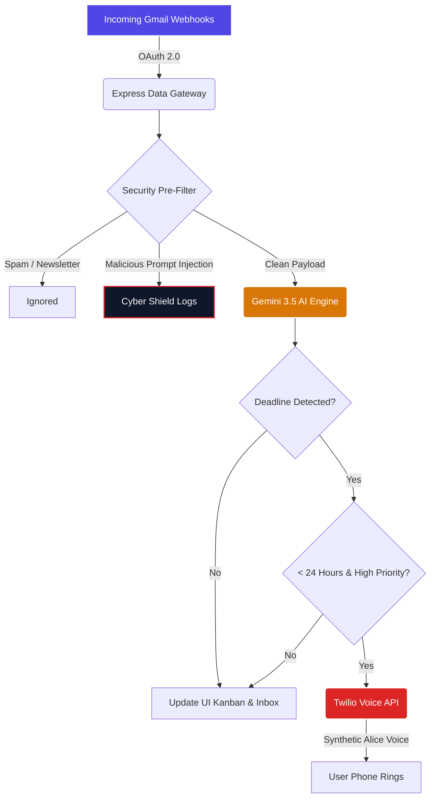

# 🚀 Mail-IQ 2.0 — AI Email Intelligence Platform

<div align="center">
  
  
  
  
  
  
</div>

<br/>

> **🏆 Winner of Chandigarh University's Stack Sprint 1.0 Hackathon (1st Place)**  
> Developed by **Team ArcLight**, Mail-IQ transforms overwhelming inboxes into intelligent, proactive task boards using Google's Gemini AI and Twilio's Programmable Voice.

## 🌟 Overview

Mail-IQ is a production-grade AI Email Productivity Copilot. Rather than simply filtering spam, Mail-IQ actively **reads, summarizes, and extracts commitments** from your emails. It transforms passive messages into actionable Kanban tasks, detects critical deadlines, and proactively triggers synthetic voice phone calls to wake you up when high-priority emergencies hit your inbox.

**Interactive Showcase Edition:** This repository is configured with a **Frontend-only Demo Mode** featuring an interactive Framer-Motion guided tour, designed explicitly for frictionless deployment and immediate evaluation by hackathon judges and recruiters.

---

## ✨ Features Spotlight

| Feature | Description |
| :--- | :--- |
| **🤖 Instant AI Summary & Sentiment** | Generates instant, digestible summaries of long threads and calculates emotional sentiment. |
| **✅ Automatic Task Extraction** | Finds hidden tasks and meeting commitments and moves them to your Kanban board. |
| **🛡️ Cyber Shield Protection** | Analyzes payloads in real-time, blocking prompt-injection attacks from malicious emails. |
| **📞 Voice Alarm Engine** | Detects critical `< 24hr` deadlines and triggers automated phone calls to your personal device. |
| **✍️ Context-Aware Smart Reply** | Drafts one-click responses based on tone (Professional, Friendly, Formal). |
| **🗂️ Smart Sender Pockets** | Automatically groups communications by sender into chronological collapsible containers. |

---

## 🏗️ System Architecture



---

## 🎨 Design System & UI

Mail-IQ 2.0 embraces a modern, premium SaaS aesthetic optimized for productivity:
- **Glassmorphism & Gradients:** Smooth, frosted-glass panels layered over deep oceanic backgrounds.
- **Micro-interactions:** Powered by `framer-motion`, every click and state change feels tactile and alive.
- **Dynamic Tooltips:** The built-in Showcase Tour directs users through the interface using spatial tracking and animated highlight rings.

---

## 🚀 Quick Start (Local Deployment)

### 1. Clone the Repository
```bash
git clone https://github.com/Devengoyal885/MailIQ-demo.git
cd mail-iq
```

### 2. Install Dependencies
```bash
npm install
```

### 3. Launch Development Server
```bash
npm run dev
```

### 4. Experience the Platform
Navigate to `http://localhost:5173` and click the **Play Showcase Tour** button hovering in the bottom right corner to begin the interactive walkthrough.

---

## 🌐 Production Build

To compile the application for static deployment (Netlify, Vercel, Render):

```bash
npm run build:client
```
The optimized bundles will be generated in the `/dist` directory.

---

## 👥 Meet Team ArcLight

Mail-IQ was conceptualized, designed, and developed by:
- **Deven Goyal** (Lead Architect & Full Stack) - [Portfolio](https://devengoyal.netlify.app) | [GitHub](https://github.com/Devengoyal885)
- **Divya Verma**
- **Rishabh Verma**
- **Aditya Singh**

---

## 📄 License

This project is distributed under the MIT License. See `LICENSE` for more information.
